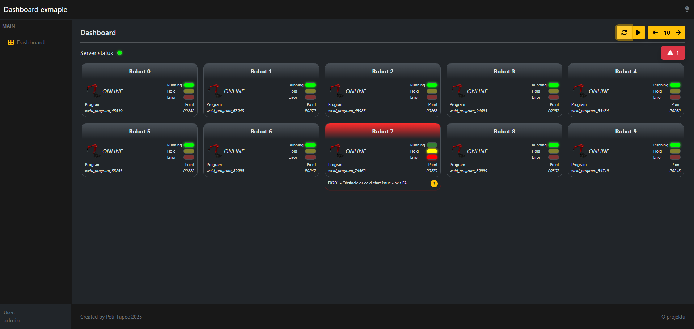
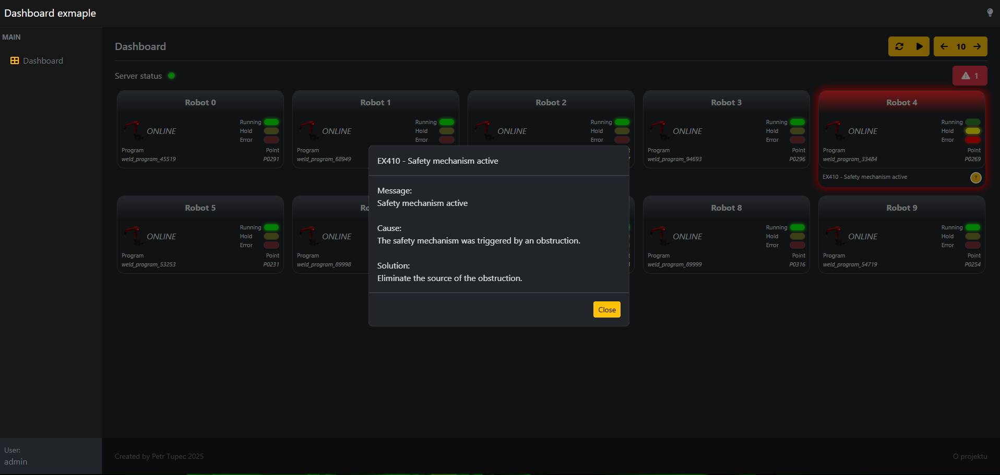
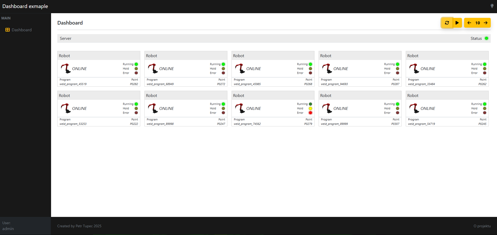

# Robot Dashboard

Aplikace zobrazuje aktuální stav robotů a je určena pro pracovníky, kteří mají za úkol zajistit plynulost výroby a řešit vzniklé problémy.

## Motivace

Cílem projektu bylo navrhnout efektivnější způsob diagnostiky chyb robotů.

V původní aplikaci byla chyba signalizována rozsvícením červené diody.
Pro identifikaci chyby bylo zapotřebí zajít k ovládacímu panelu robota kde byl kód chyby a popis. Pro příčinu poruchy a návrh řešení bylo nutné listovat v manuálu.

Na základě analýzy API bylo zjištěno, že roboti poskytují dostatek dat pro identifikaci chyby na dálku. V kombinaci s databází chyb a jejich detaily lze potřebné informace zobrazit přímo v dashboardu.

**Cílem bylo implementovat následující rozšíření:**
- světlý/tmavý režim
- výraznější indikace chyby
- responzivní zobrazení
- Zobrazení kódu a zprávy chyby
- Zobrazení detailu chyby po kliknutí na tlačítko - popis, příčina a řešení

## Funkcionalita

- Každou vteřinu vyčte z API odpovědi informace o aktuálním stavu robotů a potom je vizualizuje.
- Zvýraznění robotů, které se nachází v chybovém stavu.
- Přepínání mezi světlým a tmavým režimem aplikace.
- Responzivní rozvržení přizpůsobené pro různá zařízení (desktop, tablet, mobil).
- Zobrazení rozšířených informací o chybách robotů na základě vlastní databáze.
- Pro účely prezentace jsou přidány tlačítka pro přepínání mezi novým a starým vzhledem aplikace, změnu počtu robotů a pozastavení simulace stavu robotů.

## Popis layoutu

**Vrchní lišta**
 - název aplikace
 - přepínání světlého a tmavého režimu

**Postranní panel**
 - navigace v aplikaci

**Hlavička stránky**
 - název stránky
 - ovládací tlačítka (zleva)
    1. přepínání mezi novým a starým zobrazením
    2. pozastavení aktualizace stavu robotů
        - mění ikonu „pauza“ a „přehrát“ 
    3. odebrat robota
        - deaktivováno při minimálním počtu robotů
    4. počet robotů
    5. přidat robota
        - deaktivováno při maximálním možném počtu robotů
    6. pokud má některý robot chybu, zobrazí se červené tlačítko jako upozornění
        - při kliknutí na toto tlačítko se zobrazení posouvá mezi roboty s chybou
        - užitečné na menších obrazovkách nebo při větším počtu robotů

**Ukazatel stavu serveru**
 - mění barvu diody podle toho, zda ze serveru přicházejí data

**Karta robota**
 - název robota
 - připojení online/offline
 - barevné diody zobrazující stav
    - simulují rozsvícení a zhasnutí podle aktuálního stavu – běží, zastaven, chyba
 - název spuštěného programu
 - aktuální řádek v programu
 - pokud nastane chyba, zobrazí se spodní část karty s kódem chyby, zprávou a tlačítkem s otazníkem pro zobrazení detailu

**Patička**
 - přihlášený uživatel
 - autor aplikace
 - O projektu

## Použité technologie

### Klient

- JavaScript
- React
- React Router
- HTML/CSS
- Bootstrap

### Simulace API
	
- Mockování HTTP požadavků pomocí **Mock Service Worker (MSW)**.
- Simulace real-time stavu robotů s náhodným přiřazováním chyb.
- Generátor dat propojený přes `fetch` pro napodobení chování API.

## Ukázka UI

#### Nové zobrazení



#### Nové zobrazení - detail chyby



#### Původní zobrazení



## Online demo

Původní vzhled stránky jsem naprogramoval od základu bez použití původních kódů nebo stylování. Vzhled se mírně liší a jsou zobrazeny pouze části, které dávají smysl v rámci prezentace. Vynechal jsem například původní menu, loga a další prvky.

Pro účely prezentace je použit soubor s vybranými příklady chyb v pozměněném znění.  
Stav robotů je pouze simulován a neodpovídá skutečné chybovosti.  
Chyby jsou náhodně vybírány a přiřazovány náhodným robotům v různých časových intervalech.

Projekt je nasazený na Netlify:  
[Otevřít aplikaci](https://robot-dashboard-example.netlify.app/dashboard)

## Lokální spuštění

Aplikaci lze spustit v několika režimech podle účelu (vývoj, prezentace, produkce). Chování se řídí proměnnou `REACT_APP_API_MODE` v odpovídajících `.env` souborech.

### Dostupné režimy

| Režim           | Proměnná                      | Popis                                                                 |
|-----------------|-------------------------------|-----------------------------------------------------------------------|
| Vývoj           | `REACT_APP_API_MODE=msw`      | Používá [Mock Service Worker](https://mswjs.io/) pro simulaci API.    |
| Prezentace      | `REACT_APP_API_MODE=fakeData` | Nepoužívá MSW, data se načítají z lokálních zdrojů (fake data).       |
| Produkce        | `REACT_APP_API_MODE=server`   | Připojení k reálnému backendu.                                        |

1. Naklonování repozitáře:
```bash
    git clone https://github.com/PetrTupec/robot-dashboard-example.git
```
2. Přepnutí do složky projektu:
```bash
    cd robot-dashboard-example
```
3. Nainstalování závislostí:
```bash 
    npm install
```
4. Spuštění:
```bash 
    npm start                  # Vývojový režim s Mock Service Workerem
    npm run start:presentation # Režim s fake daty (bez MSW)
    npm run start:production   # Režim s voláním reálného backendu
```

Po spuštění bude aplikace dostupná:

- Frontend: http://localhost:3000

## Důležitá upozornění

Tento projekt napodobuje funkcionalitu jiné aplikace, avšak je **plně naprogramován od začátku**.
- **Vzhled** a **API odpovědi** se od původní aplikace **liší** a neodpovídají jí.  
- Nebyly použity žádné části původního kódu ani struktura API odpovědí.